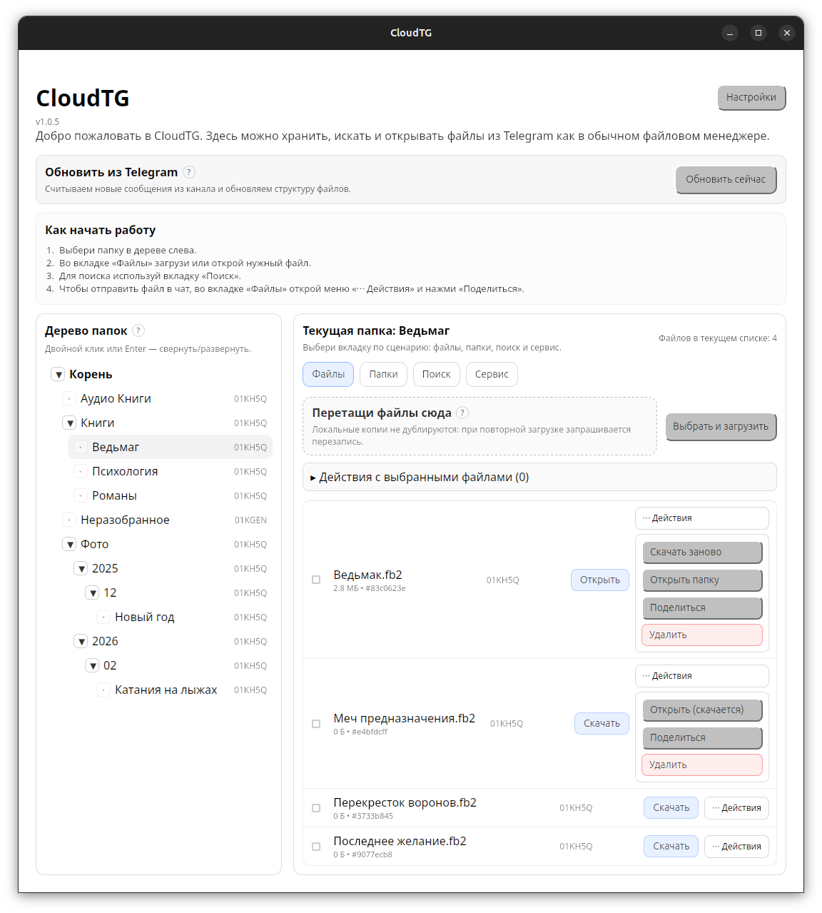

# <sub></sub> CloudTG

<p align="center">
  
</p>

CloudTG — настольное приложение, которое превращает Telegram в личное файловое хранилище с привычной структурой папок.

Кому подходит:
- тем, кто уже активно пользуется Telegram и хочет хранить документы/файлы без отдельного облачного сервиса;
- тем, кому нужен простой «второй архив» с доступом с разных устройств;
- тем, кто устал от хаоса в чатах и хочет управлять файлами через понятный интерфейс.

Какие потребности закрывает:
- централизованное хранение файлов в одном месте (канал `CloudTG`);
- быстрый поиск и навигация по папкам вместо ручного пролистывания сообщений;
- локальный кеш для быстрого открытия часто используемых файлов;
- резервное копирование локальной базы в отдельный канал (`CloudTG Backups`);
- управление файлами в формате «файлового менеджера», а не «чат-ленты».

Подробная справка по функциям и навигации:
- [docs/HELP.md](docs/HELP.md)
- Где получить `API_ID` и `API_HASH`: [docs/HELP.md](docs/HELP.md) -> `3.2 Где взять API_ID и API_HASH`

## Скачать и запустить
- Windows (portable `.zip`): [CloudTG-windows-portable-x86_64.zip](https://github.com/sumenkov/cloudtg/releases/latest/download/CloudTG-windows-portable-x86_64.zip)
- Linux (`.AppImage`): [CloudTG-linux-x86_64.AppImage](https://github.com/sumenkov/cloudtg/releases/latest/download/CloudTG-linux-x86_64.AppImage)
- macOS Intel (`.dmg`): [CloudTG-macos-x86_64.dmg](https://github.com/sumenkov/cloudtg/releases/latest/download/CloudTG-macos-x86_64.dmg)
- macOS Apple Silicon (`.dmg`): [CloudTG-macos-aarch64.dmg](https://github.com/sumenkov/cloudtg/releases/latest/download/CloudTG-macos-aarch64.dmg)
- Все релизы: [github.com/sumenkov/cloudtg/releases](https://github.com/sumenkov/cloudtg/releases)

## Запуск в разработке
Требования:
- Node.js 18+
- Rust stable (edition 2021)

<details>
<summary>Системные зависимости ОС (для сборки из исходников)</summary>

Linux (Debian/Ubuntu):
```bash
sudo apt update
sudo apt install -y pkg-config libglib2.0-dev libgtk-3-dev libwebkit2gtk-4.1-dev libayatana-appindicator3-dev librsvg2-dev patchelf git cmake gperf build-essential
```

macOS:
```bash
xcode-select --install
brew install pkg-config git cmake gperf
```

Windows 10/11:
- WebView2 Runtime (обычно уже установлен).
- Visual Studio Build Tools с компонентом C++ и Windows SDK.
```powershell
winget install Microsoft.VisualStudio.2022.BuildTools
```

</details>

Установка зависимостей приложения:
```bash
npm install
```

Запуск приложения в dev-режиме:
```bash
npm run tauri:dev
```

Сборка релизной версии:
```bash
npm run tauri:build
```

## Тестирование
Запуск всех JS/TS тестов:
```bash
npm test
```

Запуск Rust тестов:
```bash
npm run rust:test
```

## Вшитые ключи (для сборки)
По умолчанию `API_ID` и `API_HASH` вводятся в UI и не вшиваются в бинарник.

Если использовать режим вшитых ключей:
- `CLOUDTG_EMBED_API_KEYS=1`
- `CLOUDTG_API_ID=<...>`
- `CLOUDTG_API_HASH=<...>`

пример:
```bash
CLOUDTG_EMBED_API_KEYS=1 CLOUDTG_API_ID=123 CLOUDTG_API_HASH=... npm run tauri:build
```

Важно: такие ключи считаются публичными, их можно извлечь из бинарника.

## Поддержка
- Issues: https://github.com/sumenkov/cloudtg/issues
